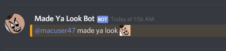

Made Ya Look Bot
================
*Made Ya Look Bot* is a discord bot that will ping random online users.

The bot will ping at random intervals between 20 minutes and 5 days.
It's designed not to be obnoxious and make pings just when you've forgotten
that the bot even exists.

Adding the Bot to a Server
--------------------------
You can find the invite link [here.](https://discordapp.com/api/oauth2/authorize?client_id=580673360501932032&permissions=0&scope=bot)

Configuration
--------------
### Emoji ###
The bot makes use of server emojis in messages and reactions.
Add the following emojis with their corresponding names for 
messages to render correctly:

ping : [image](https://discordemoji.com/assets/emoji/Pingsock.png)

moon2DEV : [image](https://steamcdn-a.akamaihd.net/steamcommunity/public/images/avatars/3d/3d4586d5dc73ab0bf0b5eeec7fd8612457da94fe_full.jpg)

### Text Channels ##
The bot will choose the first text channel that it has send permissions
to make pings. If you want to restrict it to a certain channel, make sure
that's the only channel it can send in.

Running the Bot
---------------
If you want to run your own version of the bot, put your bot token in a 
file and save it as `token.key` in the same folder as the repository.

Then run

	python bot.py

with [discord.py](https://github.com/Rapptz/discord.py) and python3.5 or greater installed.
